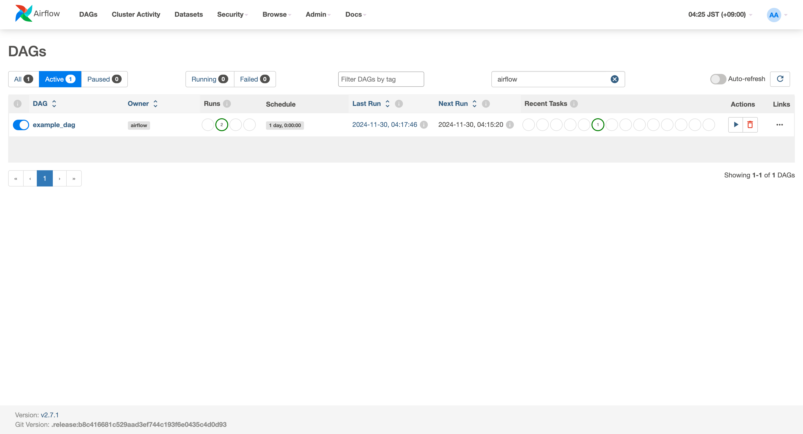

# Apache Airflow Docker Setup

A production-ready Apache Airflow setup using Docker Compose, configured with best practices for scalability and maintainability.



## Project Overview

This project provides a containerized Airflow environment with the following components:
- Apache Airflow webserver
- Airflow scheduler
- Celery workers
- PostgreSQL database for metadata
- Redis for Celery message broker

## Prerequisites

- Docker Engine 19.03.0+
- Docker Compose 1.29.0+
- Git
- At least 4GB of RAM allocated to Docker

## Quick Start

1. Clone the repository:
```bash
git clone <repository-url>
cd airflow-project
```

2. Create the necessary directories and files:
```bash
mkdir -p dags logs plugins
echo -e "AIRFLOW_UID=$(id -u)\nAIRFLOW_GID=0" > .env
```

3. Start the services:
```bash
docker-compose up -d
```

4. Access the Airflow web interface:
- URL: http://localhost:8080
- Username: airflow
- Password: airflow

## Project Structure

```
.
├── docker-compose.yaml    # Docker Compose configuration
├── Dockerfile            # Custom Airflow image definition
├── requirements.txt      # Python dependencies
├── .env                  # Environment variables
└── dags/                 # DAG files directory
    ├── __init__.py
    └── example_dag.py    # Example DAG definition
```

## Configuration

### Environment Variables

Key environment variables in `docker-compose.yaml`:
- `AIRFLOW__CORE__EXECUTOR`: Set to CeleryExecutor for distributed task processing
- `AIRFLOW__CORE__SQL_ALCHEMY_CONN`: PostgreSQL connection string
- `AIRFLOW__CELERY__BROKER_URL`: Redis connection string

### Scaling Workers

To scale the number of Celery workers:
```bash
docker-compose up -d --scale airflow-worker=3
```

## DAG Development

Place your DAG files in the `dags` directory. Example DAG structure:

```python
from airflow import DAG
from airflow.operators.python import PythonOperator
from datetime import datetime, timedelta

default_args = {
    'owner': 'airflow',
    'depends_on_past': False,
    'start_date': datetime(2024, 1, 1),
    'retries': 1,
    'retry_delay': timedelta(minutes=5)
}

with DAG(
    'example_dag',
    default_args=default_args,
    schedule_interval=timedelta(days=1),
    catchup=False
) as dag:
    # Define your tasks here
    pass
```

## Maintenance

### Viewing Logs
```bash
# View webserver logs
docker-compose logs airflow-webserver

# View scheduler logs
docker-compose logs airflow-scheduler
```

### Backup and Restore

To backup the PostgreSQL database:
```bash
docker-compose exec postgres pg_dump -U airflow airflow > backup.sql
```

### Health Checks

The setup includes health checks for:
- PostgreSQL database
- Redis broker
- Airflow webserver

## Security Recommendations

1. Change default credentials
2. Enable RBAC
3. Use secrets management
4. Regular security updates
5. Configure SSL/TLS

## Troubleshooting

Common issues and solutions:

1. **Container fails to start**
   - Check docker-compose logs
   - Verify memory allocation
   - Ensure all required ports are available

2. **DAGs not appearing**
   - Check dags directory permissions
   - Verify DAG file syntax
   - Check scheduler logs

## Contributing

1. Fork the repository
2. Create a feature branch
3. Commit changes
4. Open a pull request

## License

This project is licensed under the Apache License 2.0.
